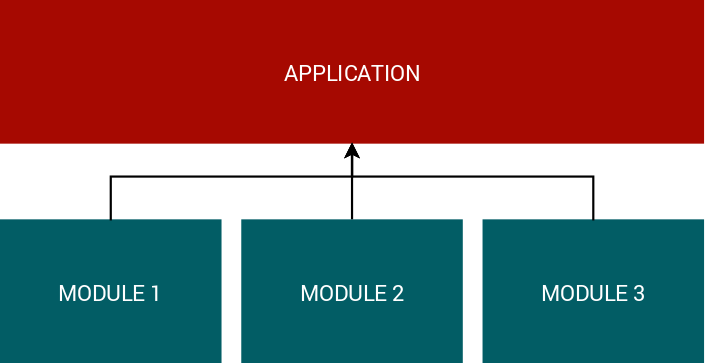

# Concord Overview

_Concord's main feature is to enable **Modules for Laravel Applications** on top
of Laravel's built in Service Providers._

## Why Modules?

There are two major use-cases for using modular organization:

1. **Organizing Application** Structure (within a single application)
2. Creating **Reusable Modules** (across several applications)

### Organizing An Application

Most of the business applications quickly reach the level of complexity where it
matters the way the code is being organized. There are several approaches to
organizing the code, and one of them is the modular structure - this is what
Concord was built around.

In case a module lives within the app's codebase (ie. not installed via
composer) then Concord calls that an _in-app module_. These modules shouldn't
consider any code re-use, just keep related functionality in more or less
decoupled modules.

### Reusable Modules

Concord was written with extensible modules in mind. You may have code you're
copypasting from one project to another, or even worse - starting from scratch
over and over with minimal changes again. These repeating units can be
outsourced to modules and can be used across several applications that use those
modules in a specific, custom manner.

These kinds of modules are libraries, usually have their own repository and are
typically installed with composer. Concord calls these _external modules_. These
kinds of modules should consider that they'll be used by applications that
probably want to alter or extend their basic behavior. Concord has quite several
facilities to support that.

#### Example Scenario

You may have an in-house CMS module that can handle pages, posts in multiple
languages. App "A" only want the pages feature in a single language while app
"B" wants all the CMS features. Then comes your client of app "A" and says they
want to assign a specific color to each page. You can decide whether you want to
implement this in your common CMS module or just for app "B". With Concord you
shall be able to do either of those.

#### Composing Parts

Modules consist of different [parts](map.md) like models (entities),
controllers, config files, migrations, views, routes, requests, middleware,
frontend assets and so on.

Laravel itself solves many of these problems, so **whenever a solution in
Laravel exists, it's being used**.

## Modules

Modules are the de-coupled implementations of the business logic and they have
to comply with Concord's basic rules in order to be able to cooperate as a
unified application.

## Boxes

Boxes are optional. Think of them as "boilerplate" applications. They wrap
several modules, and are subject to customization by the final Application.

## Application

Any Laravel 5.5+ application can be a Concord compliant application that
complies with its rules.

The application defines it's own logic and incorporates Concord
modules and/or boxes.

### Simple Layout (Modules Only)

### Multi-box Layout

## Why Boxes And Modules?

Reading further you'll see that some [parts](map.md) are advised to be kept in
modules and others in boxes/application.

The reason behind is that modules should be kept decoupled, so whenever it's
possible, they should not be aware of other modules. In case they really depend
on another module, this dependency should be expressed explicitly (via
composer). Number of dependent modules should be kept as low as possible.

Modules however need to be "glued" together, by pivot tables, aggregate classes,
controllers, forms, event-listeners, etc. Concord encourages these kinds of
parts to be implemented either in boxes or in the application. Boxes are
technically modules as well.

Concord has a [recommendation](map.md) of which part should be implemented
where. For example it's possible to define controllers in modules, but it is
recommended that you rather implement controllers in boxes or in the
application.

**Next**: [Installation &raquo;](installation.md)
