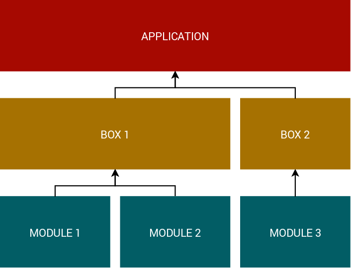

# Concord Overview

_Concord's most important feature is to enable **Modules for Laravel Applications** on top of Laravel's built in Service Providers._

## Why Modules?

Concord was written with extensible modules in mind. You may have code you're copypasting from one project to another, or even worse - starting from scratch over and over with minimal changes again.
These repeating units can be outsourced to modules and can be used across several applications that use those modules in a specific, custom manner.

##### Example Scenario

You may have an in-house CMS module that can handle pages, posts in multiple languages. App "A" only want the pages feature in a single language while app "B" wants all the CMS features. Then comes your client of app "A" and says they want to assign a specific color to each page. You can decide whether you want to implement this in your common CMS module or just for app "B". With Concord you shall be able to do either of those.

##### Composing Parts

Modules consist of different [parts](parts.md) like model classes, entities, controllers, config files, migrations, views, routes, middleware, frontend assets and so on.

Laravel itself solves many of these problems, so **whenever a solution in Laravel exists, it's being used**.

## Modules

Modules are the de-coupled implementations of the business logic and they have to comply with Concord's basic rules in order to be able to cooperate as a unified application.

## Boxes

Boxes are optional. Think of them as "boilerplate" applications. They wrap several modules, and are subject to customization by the Application.

## Application

Any Laravel 5.3+ application can be a Concord compliant application that
complies with its rules.

The application defines it's own logic and incorporates Concord
modules and/or boxes.

### Simple Layout (Modules Only)

### Multi-box Layout

## Why Boxes And Modules?

Reading further you'll see that some [parts](parts.md) are advised to be kept in modules and others in boxes/application.

The reason behind is that modules should be kept decoupled, so they most often should not be aware of other modules. In case they really depend on another module, this dependency should be expressed explicitely (via composer). Number of dependent modules should be kept as low as possible.

Modules however need to be "glued" together, by pivot tables, aggregate classes, controllers, forms etc. Concord encourages these kinds of parts to be implemented either in boxes or in the application. Boxes are technically modules as well.

Concord has a [recommendation](map.md) of which part should be implemented where. For example it's possible to define controllers in modules, but it is recommended that you rather implement controllers in boxes or in the application.

#### Next: [Directory Structure &raquo;](directory-structure.md)